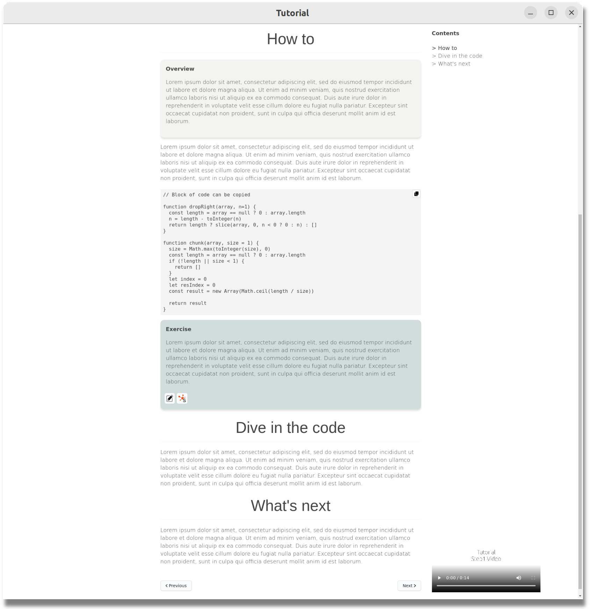

# Empty tutorial

A simple PyQt application to make SOFA tutorials. The tutorial is based on 
markdown files, whose path are filled in the file `tutorial.py`.

## Requirements

Have SOFA installed, and the path to `runSofa` in the PATH system variable.

Install :

- python3-pyqt5
- python3-pyqt5.qtwebchannel
- python3-pyqt5.qtwebengine

## How to

```commandline
python3 tutorial.py
```

To highlight a section of the tutorial, in the markdown file, use the following html code :

```html
<div class="highlight-content">
<strong>Title</strong> 

The text you want to highlight.
    
</div>
```

To create an exercise section (with open in editor and runSofa buttons), in the markdown file, use the following html code :

```html
<div class="exercise-content">
<strong>Exercise</strong>

Your exercise. 
    
</div>
```


